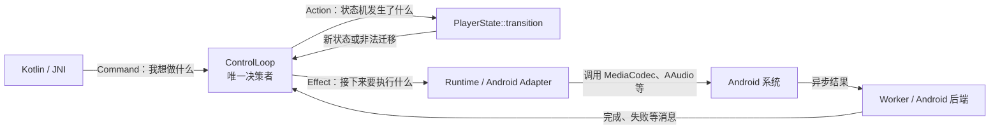

## 总原则
设计出 Command, Action, State, Effect, ControlLoop,总的原则是**把“做决定”和“干具体的活分开”**。
播放器不是普通函数调用。用户可能随时`Play`，`Pause`,`Seek`, `Stop`，Andrioid 的 MediaCodec、AAudio、
Surface 又会异步返回结果。如果每个模块都能直接修改播放器状态，系统很快就会变成：
```
JNI 认为正在 Playing
音频线程认为正在 Paused
解码线程还在处理 seek 前的数据
Surface 已经销毁但视频仍在提交
```
因此需要一个唯一决策者： `ControlLoop`。


## 五个概念各自回答一个问题
| 概念 | 回答的问题 |
|---|---|
| `PlayerState` | 播放器现在处于什么状态？ |
| `PlayerCommand` | 外部调用者想让播放器做什么？ |
| `StateAction` | 从状态机角度看，发生了什么？ |
| `ControlLoop` | 根据当前状态和输入，最终应该如何处理？ |
| `ControlEffect` | 决策完成后，外部世界具体要做什么？ |
可以把它们记成一句话：
```
Command 是意图
Action 是状态机语言
State 是事实
Effect 是待执行工作
ControlLoop 是决策者
```
---
### 1. State: 已经成立的事实
```rust
pub enum PlayerState {
    Idle,
    Preparing,
    Ready,
    Playing,
    Paused,
    Error,
    Released,
}
```
`State`不表示“想做什么”，也不表示“接下来做什么”，只表示当前已经成立的事实。
例如：
```
Preparing：正在准备，还不能播放
Ready：媒体已经准备完成，可以播放
Playing：已经进入播放状态
Released：资源已经永久释放
```
状态的价值在于压缩历史。
播放器可能经历过：
```
Idle → Preparing → Ready → Playing → Paused
```
后续代码不需要记住全部历史，只需要知道当前是`Paused`，就能决定是否允许`Play`。
所以 State 的本质是：
> 对过去所有有效操作进行汇总后，得到的当前事实。
---
### 2. Command: 外部传进来的意图
```rust
pub enum PlayerCommand {
    Prepare,
    Play,
    Pause,
    Seek(MediaTime),
    Stop,
    Release,
}
```
Command 只表达调用者的请求：
```
“我想播放”
“我想跳到 60 秒”
“我想释放播放器”
```
它不保证请求合法。
例如：
```rust
PlayerCommand::Play
```
既可能出现在`Ready`，也可能出现在`Idle`。
Command 自己不知道当前状态，所以它不能决定自己能否执行。
因此：
> Command 是请求，不是事实，也不是执行结果。
这和 HTTP 请求类似。客户端可以发出“删除订单”的请求，但订单是否存在、当前是否允许删除，要有服务器判断。
---
### 3. Action：翻译成状态机能理解的语言
StateAction 一句话总结是 “状态迁移触发的原因”。

Command 和 Action 确实容易产生误解
#### Seek 更能体现两者区别
Command 携带具体参数：
```rust
PlayerCommand::Seek(MediaTime)
```
例如： 
```
跳到 60 秒
```
但状态机只关心：
```
当前状态允不允许 seek？
```
它不关心是跳到 10 秒还是 60 秒，因此转换成：
```rust
StateAction::Seek
```
参数被保留给后面的`ControlEffect`。
所以：
```
Command::Seek(60s)
          │
          ├─ StateAction::Seek
          │      用于检查 Playing 是否允许 seek
          │
          └─ ControlEffect::Seek(60s)
                 用于真正执行 seek
```
这就是 Command 和 Action 分层的核心价值：
> Command 保存调用意图和参数，Action 只保留状态机需要理解的信息。
---
### 4. ControlLoop：唯一的决策者
`ControlLoop` 持有状态：
```rust
pub struct ControlLoop {
    state: PlayerState
}
```
它做的事情可以抽象成一个公式：
```
当前 State + 输入 Command
        ↓
新 State + ControlEffect
```
也就是：
```
handle_command(
    current_state,
    command,
) -> Result<(next_state, effect), error>
```
---
### 5. ControlEffect：经过批准的待执行工作

```rust
pub enum ControlEffect {
    BeginPrepare,
    StartPlayback,
    PausePlayback,
    Seek(MediaTime),
    Stop,
    Release,
    None,
}
```
Effect 不是“已经执行完成”， 而是：
> ControlLoop 完成状态验证后，批准外部执行的一项工作。
Effect 把它拆成：
```
第一阶段：决定做什么
第二阶段：执行决定
第三阶段：把执行结果报告回来
```
这是一种通用的“决策与副作用分离”设计。

---
## 这套设计背后的三种通用思想
### 1. 状态机
明确规定：
```
什么状态下允许什么操作
操作之后进入什么状态
```
### 2. 单一所有者/ Actor 思想
只有一个控制线程拥有并修改状态。其他线程通过消息沟通。
适用于异步、多线程、资源声明周期复杂的系统。

### 3. Functional Core, Imperative Shell

核心只做计算：
```
 State + Input → New State + Effect
```
外壳负责真正的副作用：
```
文件、网络、线程、MediaCodec、AAudio、Surface
```
这使平台无关的 Rust 核心和 Android 实现自然分开。
---
### 核心闭环

“副作用”指的是：
> 一个函数除了返回结果之外，还改变了外部世界，或者依赖了外部世界中不稳定的状态。

```
ControlEffect：描述希望世界发生什么变化
Effect executor：真正让世界发生变化
```

最后，用一个判断方法：
> 如果忽略函数返回值，调用这个函数之后，还有没有其他东西可能发生变化，或者函数结果是否依赖当前环境？

- 如果没有：通常是纯计算。
- 如果有：它与外部世界发生了交互。
而“外部”永远是相对于当前函数、模块或系统边界而言的。

```
输入意图
   ↓
集中决策
   ↓
更新事实
   ↓
发出工作指令
   ↓
外部执行
   ↓
结果再次成为输入
```
