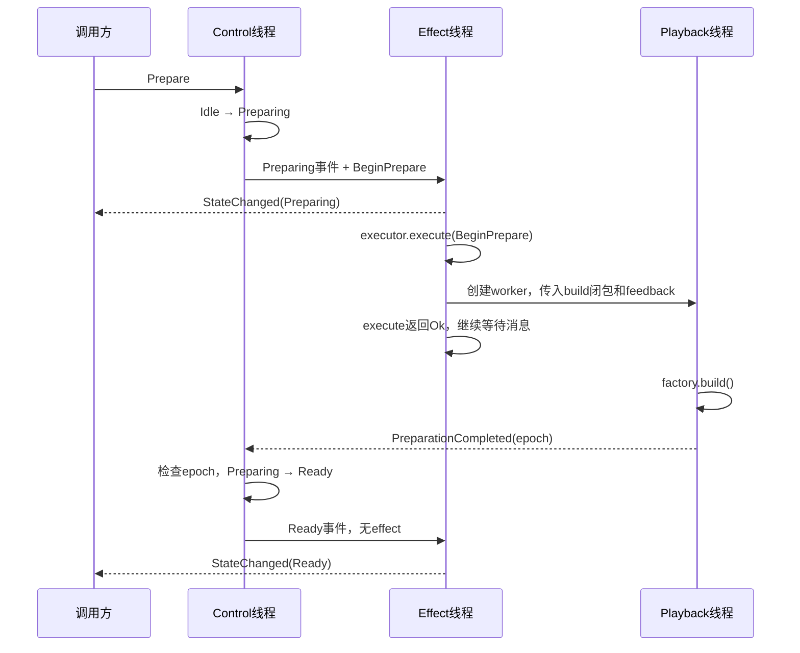

## Effect 线程职责
目前 effect 的工作主要是：接收命令、执行工作和报告结果。

它的核心职责可以写成一句话：
> 接收 Control 的处理结果，把事件通知调用方，把 effect 交给执行器，并把执行失败送回 Control。

### 1. 从三个通信方向理解它

`run_effect_loop()` 的参数已经把职责表达出来了：
```rust
pub fn run_effect_loop<E>(
    result_receiver: Receiver<ControlResult>,
    event_sender: Sender<PlayerEvent>,
    feedback_sender: Sender<ControlMessage>,
    mut executor: E
) -> EffectLoopExit
```
分别对应：
| 参数 | 方向 | 用途 |
|---|---|---|
| `result_receiver` | Control → Effect | 接收控制层的处理结果 |
| `event_sender` | Effect → 调用方 | 通知状态变化、进度、错误等 |
| `feedback_sender` | Effect / worker → Control | 报告执行结果 |
| `executor` | Effect 线程内部持有 | 落实具体的 effect |

注意两个发送方向的区别：
```
PlayerEvent：
告诉调用方发生了什么。

ControlMessage::WorkerEvent:
把结果交给 Control，让它继续做决定。
```
例如，worker 准备好媒体以后，需要先通知 Control。Control 确认消息仍然有效、更新状态，再向调用方报告`Ready`。
这样对外状态始终经过同一个决策者。

### 2. Control 交给 effect 线程的，是什么？
当前有两层结构：
```rust
type ControlResult = Result<ControlOutcome, ControlError>;
```
成功时：
```rust
pub struct ControlOutcome {
    pub effect: Option<ControlEffect>,
    pub event: Option<PlayerEvent>,
}
```
外层`Result`回答：
> Control 是否成功处理了这条输入？

内层两个`Option` 回答:
> 是否有实际工作需要执行？是否有事件需要通知外部？

例如： 
| Control 处理的输入 | effect | event |
|---|---|---|
| Ready 状态下的 Play | `StartPlayback` | `StateChanged(Playing)` |
| worker 报告准备完成 | 无 | `StateChanged(Ready)` |
| worker 报告进度 | 无 | `AudioProgress` |
| Playing 状态下 Seek | `Seek` | 通常无状态变化事件 |
| 已过期的 worker 消息 | 无 | 无 |
所以 effect 线程接收的是完整的`ControlOutcome`，需要同时处理执行和通知两部分。

### 3. 一轮 effect 循环，按什么顺序执行？

当前代码可以压缩成：
```
① 接收 ControlResult
② 处理 ControlError
③ 发送 outcome.event
④ 如果有 outcome.effect：
      创建反馈上下文
      调用 executor.execute()
      处理执行结果
⑤ 决定继续等待，还是退出线程
```

### 4. EffectExecutor 负责落实工作，自己并不代表一条线程

它只是一个接口：
```rust
pub trait EffectExecutor: Send {
    fn execute(
        &mut self,
        effect: ControlEffect,
        feedback: &EffectFeedback,
    ) -> Result<(), PlaybackError>
}
```
当前有`PlaybackEffectExecutor`实现。
职责分界是：
```
run_effect_loop:
接收消息、通知外部、处理执行结果。

PlaybackEffectExecutor:
知道某个 effect 应该如何操作播放会话。
```
例如：
```
BeginPrepare → 创建 worker
StartPlayback → 发送 Start
Seek → 发送 Seek
Release → 取消并等待 worker 退出
```
`run_effect_loop()` 调用 `execute()` 时，是普通函数调用，发生在同一条 Effect 线程中。
`Send`的用途是允许执行器随闭包移动到这条线程。它由 effect 循环独占，`execute()` 使用`&mut self` 操作自己的会话数据，不需要通过互斥锁共享这个执行器。

### 5. execute() 返回 Ok(()), 到底保证了什么？

这是最容易混淆的地方。
成功的含义取决于这个 effect 实际执行的操作。

| effect | 当前 `Ok(())` 的含义 |
|---|---|
| `BeginPrepare` | 播放 worker 已成功创建并保存句柄 |
| `StartPlayback` / `PausePlayback` / `Seek` | 命令已经成功发送到 worker 通道 |
| `Stop` / `Release` | 当前 worker 已完成关闭和 join，或本来就不存在 |
因此：
```
BeginPrepare 执行成功
```
不等于：
```
文件已经打开，decoder 已经准备好
```
worker 还要在线程内部调用`factory.build()`。它可能成功，也可能稍后失败。
这就是为什么同时需要：
```
execute()的返回值
+
后续异步反馈
```
前者报告当前执行步骤的结果，后者报告 worker 后续工作的结果。

### 6. EffectFeedback 是带有播放代次的反馈入口

它保存
```rust
pub struct EffectPlayback {
    epoch: PlaybackEpoch,
    sender: Sender<ControlMessage>,
}
```
effect 循环每次执行工作前，会创建：
```rust
let effect_feedback = EffectFeedback::new(effect.epoch(), feedback_sender.clone())
```
之后执行器可以把它克隆并交给 worker。
例如：
```rust
feedback.preparation_completed()
```
虽然类型名叫`EffectFeedback`，worker 使用它发送的消息直接进入 Control 通道，不需要先经过 effect 线程。

### 7. 用 Prepare 完整走一遍


这条流程体现了：
- Control决定能否准备。
- Effect 线程安排准备工作。
- Playback 线程实际构建 pipeline。
- Control 根据完成反馈确认 Ready。
